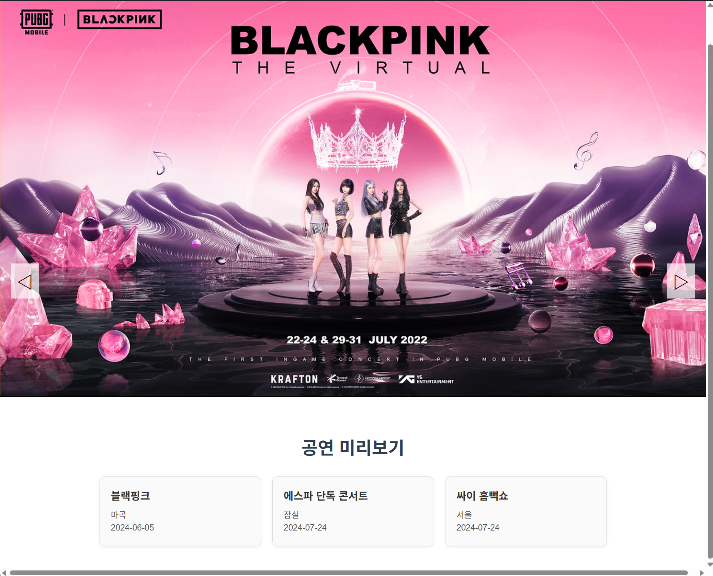
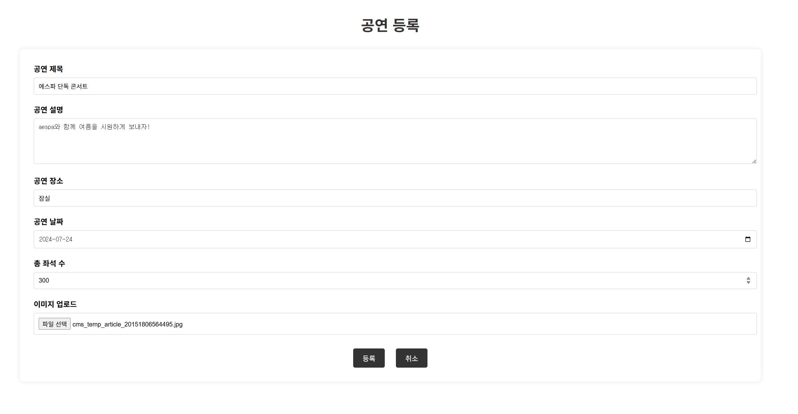
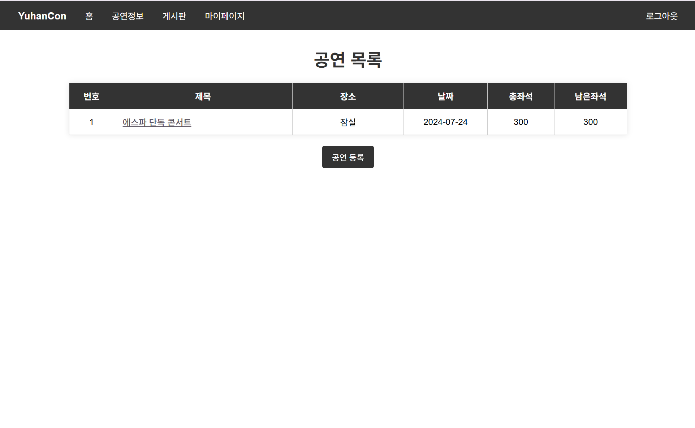
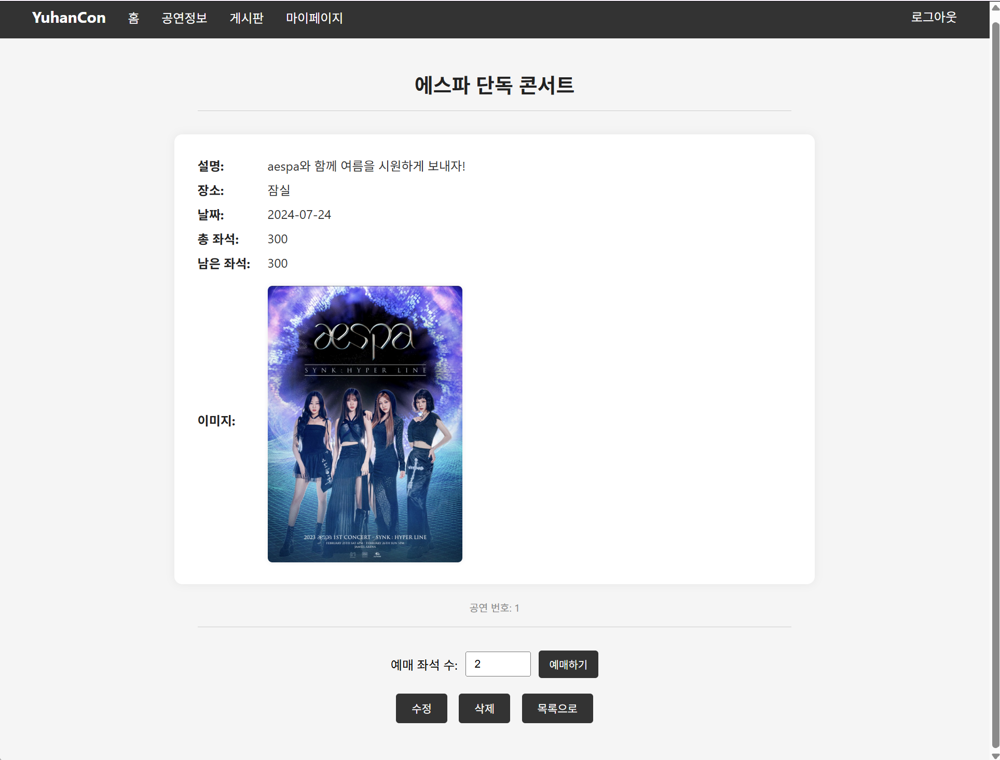
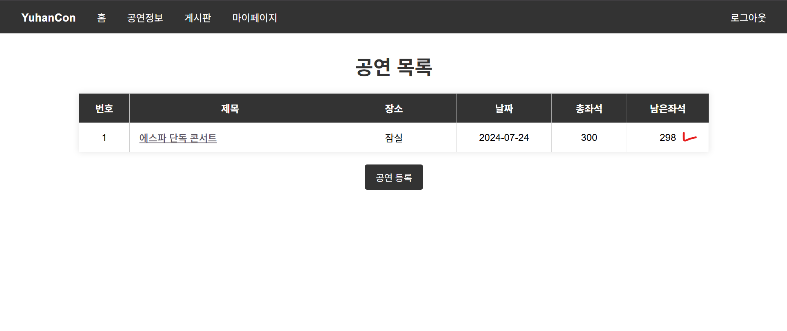
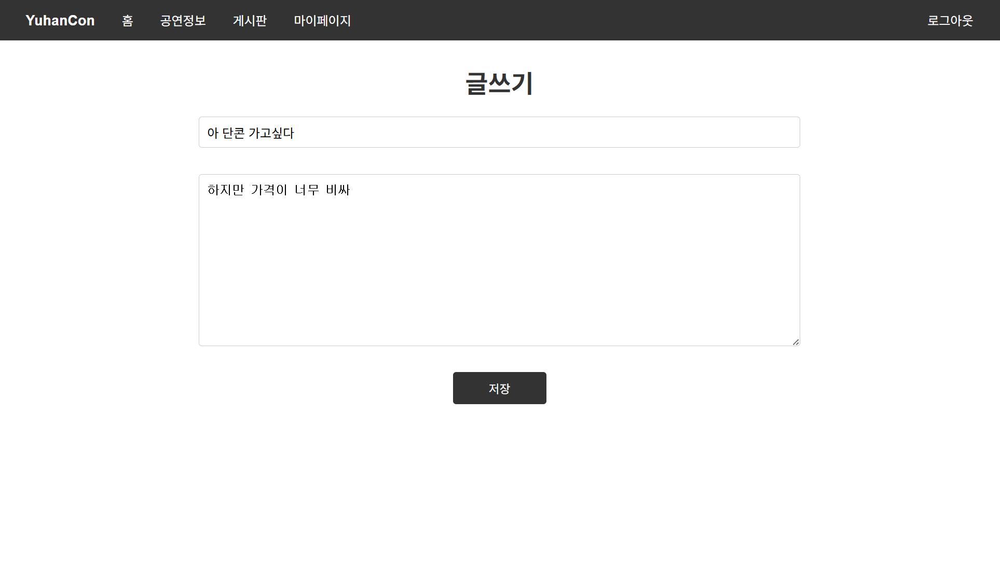
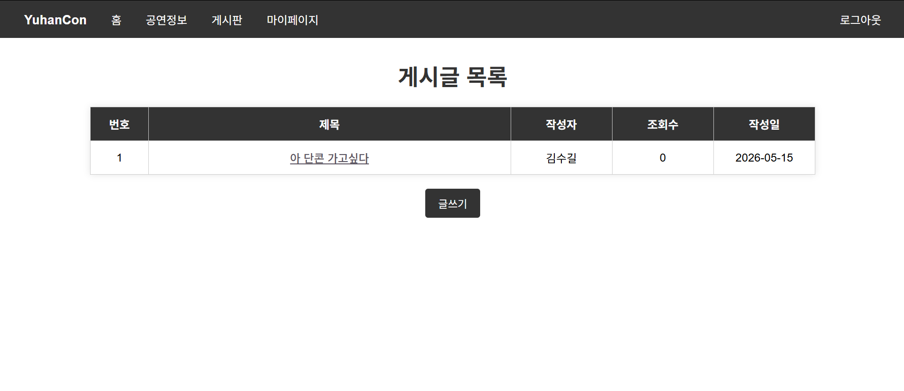
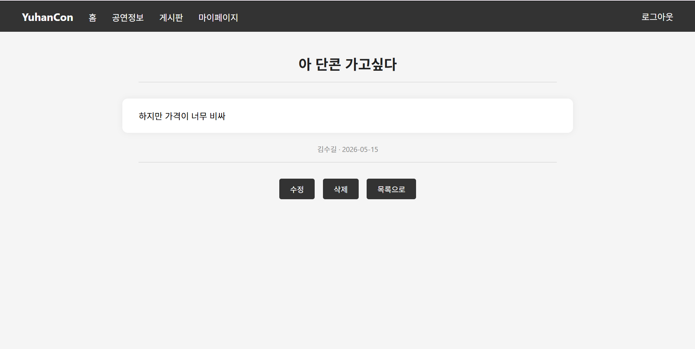
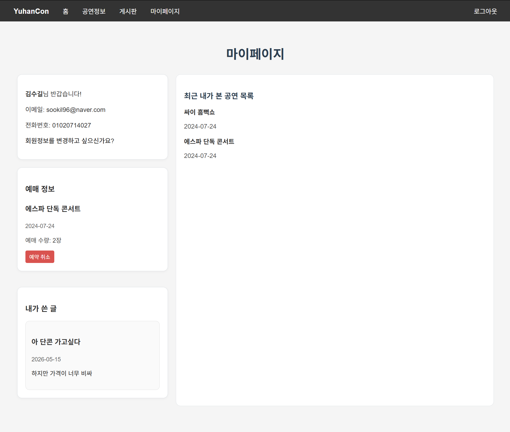

# YuhanCon

> Spring Boot 기반 공연 예약 및 커뮤니티 웹 애플리케이션

Spring Boot의 숙련을 위한 2인 팀 프로젝트 입니다. 

---

## 목차

- [소개](#소개)
- [담당 파트](#담당-파트)
- [주요 기능](#주요-기능)
- [기술 스택](#기술-스택)
- [실행 흐름](#실행-흐름)
- [설치 및 실행](#설치-및-실행)

---

## 소개

공연 정보를 조회하고 예약할 수 있는 웹 애플리케이션입니다.
회원가입 / 로그인부터 공연 예약, 커뮤니티 게시판, 마이페이지까지 구현한 종합 프로젝트입니다.

---

## 담당 파트

### 팀원 역할 분담

| 역할 | 담당 내용 |
|------|----------|
| 김수길 | 구조 설계, 회원가입 및 로그인, 게시판 관련 기능, 마이페이지 |
| 김원정 | 메인화면 슬라이드, 공연 미리보기 기능, 공연정보 관련 기능, 테스트 |

---

### 로그인 (Spring Security)

Spring Security를 활용해 폼 기반 로그인 / 로그아웃 인증 시스템을 구현했습니다.

**구현 내용**
- 이메일을 아이디로 사용하는 폼 로그인 구현
- 로그인 성공 시 메인 페이지로 리다이렉트, 로그아웃 시 세션 완전 초기화
- 비로그인 사용자는 메인, 회원가입, 로그인 페이지만 접근 허용, 나머지는 로그인 필수
- 관리자 전용 페이지에 역할 기반 접근 제어 적용

---

### 게시판 (Board)

**구현 내용**
- 게시글 작성 / 수정 / 삭제 / 목록 조회 / 상세 조회 전체 구현
- 게시글 상세 페이지 접근 시 조회수 자동 증가
- 로그인 유저와 작성자를 비교해 본인 게시글만 수정, 삭제 버튼 노출
- 로그인한 사용자 정보를 인증 객체에서 가져와 게시글 작성자로 자동 저장

---

### 마이페이지

**구현 내용**
- 로그인한 회원의 기본 정보 조회
- 내가 작성한 게시글 목록 조회
- 나의 공연 예약 내역 조회
- 최근 조회한 공연 최대 5개 표시 (최신순 정렬)

---

## 주요 기능

- 회원가입 / 로그인 / 로그아웃
- 공연 목록 조회 및 예약
- 커뮤니티 게시판 (작성 / 수정 / 삭제 / 조회)
- 마이페이지 (예약 내역, 내 게시글, 최근 본 공연)

---

## 기술 스택

### Backend

| 기술 | 용도 |
|------|------|
| Java | 메인 언어 |
| Spring Boot | 웹 프레임워크 |
| Spring Security | 인증 / 인가 |
| Spring Data JPA | DB 연동 |
| H2 | 데이터베이스 (개발용) |

### Frontend

| 기술 | 용도 |
|------|------|
| Thymeleaf | 서버 사이드 템플릿 |
| HTML / CSS / JavaScript | UI 구성 |

---

## 실행 흐름

### 1. 메인 화면

> 등록된 공연이 슬라이스로 지나가게 되며 현재 예약 가능한 공연 정보가 표시됩니다.
---

### 2. 공연 게시판

| 공연 등록 | 공연 세부 내용 | 공연 목록 |
|:---:|:---:|:---:|
|  |  |  |
> 공연을 등록할 수 있으며 공연 세부내용과 공연 목록을 확인할 수 있습니다. 
---

### 3. 공연 예매

| 예매 창 | 좌석 카운팅 |
|:---:|:---:|
|  |  |
> 예매 시 좌석이 카운팅되어 몇 자리가 남았는지 화면에 뜨게 됩니다.
---

### 4. 자유 게시판

| 글쓰기 | 게시글 목록 | 게시글 상세 |
|:---:|:---:|:---:|
|  |  |  |
> 간단한 자유 게시판입니다.
---

### 5. 마이페이지

> 회원정보 수정, 예약 관련, 게시판 관련, 최근 본 공연 목록 한번에 조회 가능합니다
---

## 설치 및 실행

1. h2 console 다운로드
2. `application.properties`에서 DB 연결 정보 설정
3. 프로젝트 빌드 후 실행
4. `http://localhost:8080` 접속

---
